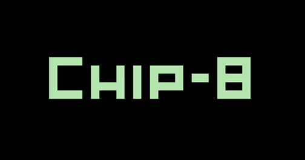

<h1 align="center">
  
</h1>

  <strong>Vintage Computing: Interpreting the CHIP-8</strong>

  

  
  

  Works on  Windows,
   macOS and
   Linux.

---

## 😎 Project Basis

The goal of this project is to create a pedagogical example of a CHIP-8 interpreter, using Python. There are _many_ CHIP-8 implementations out there but many of them are based on more modern implementations, often based on modern interpretations of specifications. That's not a bad thing, by any means. However, there are few examples that are based on the specifications provided in the original references from the late 1970s, which is what **terp8or** aims to be.

You can check out my [project documentation](https://jeffnyman.github.io/terp8or/) for more details. There you will see some of those original references that I will be using as well as references to modern specifications.

If you find any of this useful, consider leaving a ⭐️ for the repo.

## 👤 Author

	Made with 🤍 by Jeff Nyman

  

  &nbsp;&nbsp;&nbsp;
  

## ☦️ Doxazein (δοξάζειν)

  חֶסֶד וֶאֱמֶת אַל־יַעַזְבֻךָ קָשְׁרֵם עַל־גַּרְגְּרֹתֶיךָ כָּתְבֵם עַל־לוּחַ לִבֶּךָ

"Let not mercy and truth forsake thee: 
bind them about thy neck; 
write them upon the table of thine heart."

## ⚖ License

The code used in this project is licensed under the [MIT license](https://github.com/jeffnyman/terp8or/blob/main/LICENSE).
